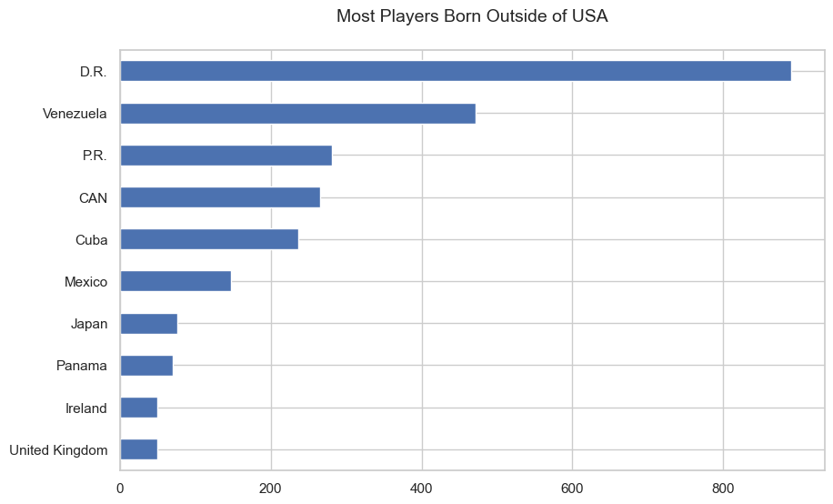
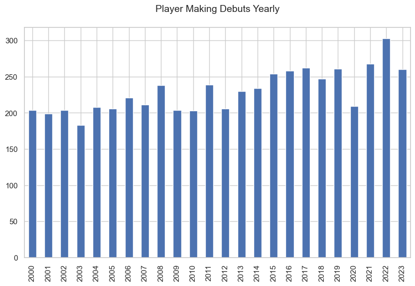
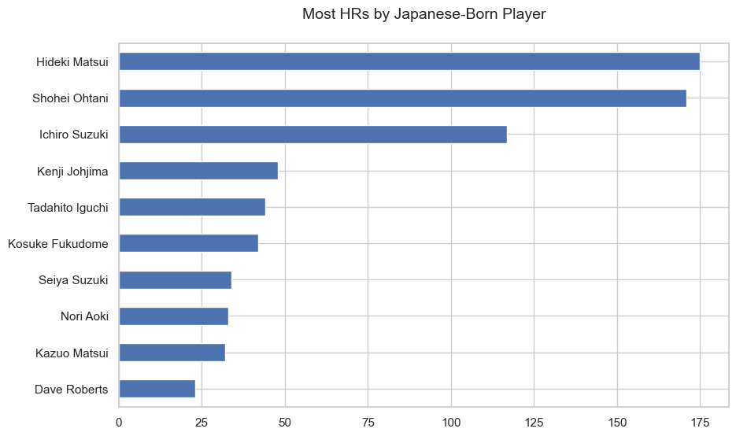
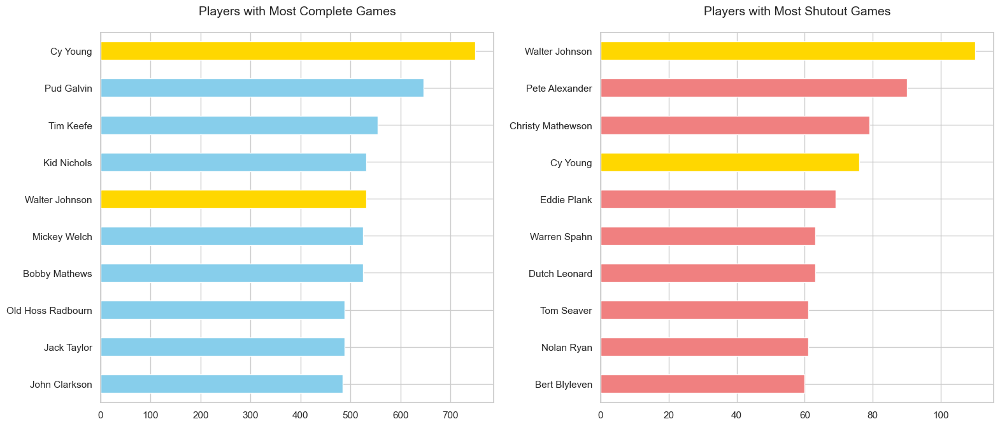
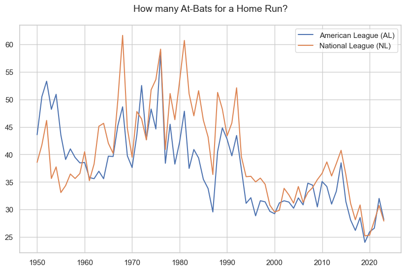

# Lahman Baseball Database Analysis

## Project Overview

This project delves into the rich history of Major League Baseball (MLB) using [Sean Lahman's Baseball Database](http://www.baseball1.com). The primary objective is to apply and showcase data analysis techniques using both the Python data science ecosystem (Pandas, Matplotlib, Seaborn) and SQL (PostgreSQL). By loading, cleaning, querying, and visualizing this comprehensive dataset, we aim to uncover interesting trends, player performance patterns, and demographic insights from baseball history.

## Data Source

* **Source:** Sean Lahman's Baseball Database 
* **Website:** http://www.baseball1.com
* **Version:** 2023 Version
* **Description:** A comprehensive, publicly available dataset containing pitching, hitting, and fielding statistics, along with information on teams, players, salaries, awards, and more, spanning MLB history.

## 📈 Analysis and Findings

#### 1. Which non-USA countries have the highest representation of players in MLB history?

#### 2. What is the annual trend in the number of players making their MLB debut from 2000 onwards?

#### 3. Who are the leading Japanese-born players ranked by total career Home Runs?

#### 4. Which MLB pitchers have recorded the highest career totals for Complete Games and Shutouts?

#### 5. How has the rate of At-Bats per Home Run trended for both the American League and National League since 1950?

#### 6. How does the highest player salary compare to the median player salary each year, and what is the trend of this ratio? 🖥️ Query: [salary.sql](sql/queries/01_salary.sql)
🔎 Sample Output

|   year | team_name           | highest_salary_player   |   highest_salary |   median_salary |   ratio |
|-------:|:--------------------|:------------------------|-----------------:|----------------:|--------:|
|   2012 | New York Yankees    | Alex Rodriguez          |         30000000 |         1100000 |    27.3 |
|   2013 | New York Yankees    | Alex Rodriguez          |         29000000 |         1350000 |    21.5 |
|   2014 | Los Angeles Dodgers | Zack Greinke            |         26000000 |         1500000 |    17.3 |
|   2015 | Los Angeles Dodgers | Clayton Kershaw         |         32571000 |         1880000 |    17.3 |
|   2016 | Los Angeles Dodgers | Clayton Kershaw         |         33000000 |         1500000 |    22   |

#### 7. Who won the AL and NL MVP awards each year, and what were their respective voting points and percentage shares?  🖥️ Query: [mvp.sql](sql/queries/02_mvp.sql)
🔎 Sample Output

|   year_id | al_mvp        |   al_mvp_points |   al_mvp_pct | nl_mvp           |   nl_mvp_points |   nl_mvp_pct |
|----------:|:--------------|----------------:|-------------:|:-----------------|----------------:|-------------:|
|      2019 | Mike Trout    |             355 |        0.845 | Cody Bellinger   |             362 |        0.862 |
|      2020 | Jose Abreu    |             374 |        0.89  | Freddie Freeman  |             410 |        0.976 |
|      2021 | Shohei Ohtani |             420 |        1     | Bryce Harper     |             348 |        0.829 |
|      2022 | Aaron Judge   |             410 |        0.976 | Paul Goldschmidt |             380 |        0.905 |
|      2023 | Shohei Ohtani |             420 |        1     | Ronald Acuna     |             420 |        1     |

#### 8. How do MLB teams rank since 2000 based on their combined success? 🖥️ Query: [team.sql](sql/queries/03_team.sql)
🔎 Sample Output

| name                  |   world_series_won |   regular_game_won |   total_home_attendance |   rank_by_games |   rank_by_attendance |
|:----------------------|-------------------:|-------------------:|------------------------:|----------------:|---------------------:|
| Boston Red Sox        |                  4 |               2064 |                64813148 |               1 |                    6 |
| San Francisco Giants  |                  3 |               1972 |                70734879 |               2 |                    4 |
| New York Yankees      |                  2 |               2192 |                79854508 |               3 |                    2 |
| St. Louis Cardinals   |                  2 |               2096 |                75220248 |               4 |                    3 |
| Houston Astros        |                  2 |               1941 |                58089977 |               5 |                   11 |
| Los Angeles Dodgers   |                  1 |               2141 |                81283525 |               6 |                    1 |
| Atlanta Braves        |                  1 |               2063 |                58679666 |               7 |                   10 |
| Philadelphia Phillies |                  1 |               1924 |                59734344 |               8 |                    9 |

## Technologies & Environment

* **Programming Language:** Python (3.11.9), SQL
* **Database:** PostgreSQL
* **Core Libraries:**
    * pandas
    * numpy
    * matplotlib
    * seaborn
* **Development Environment:** Jupyter Notebooks, VS Code

